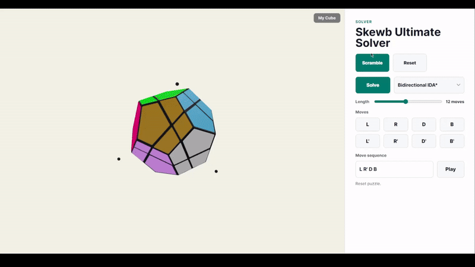
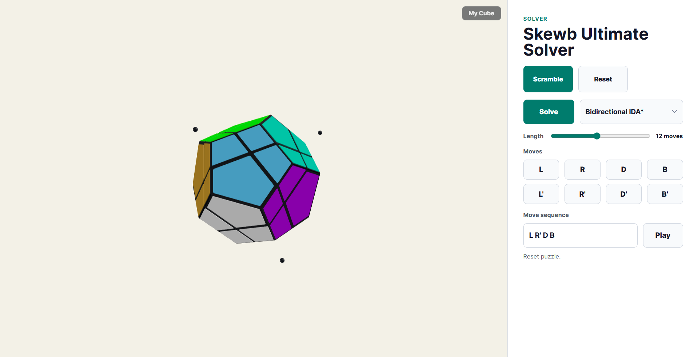
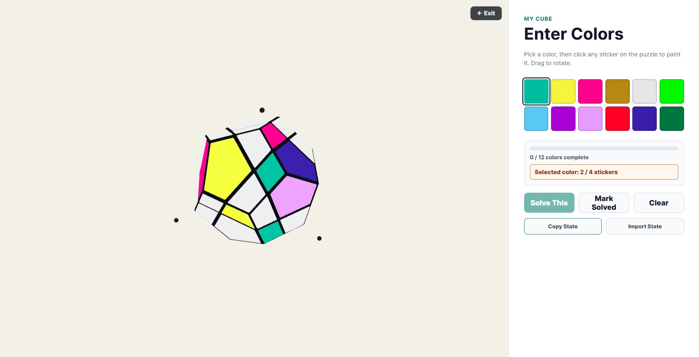
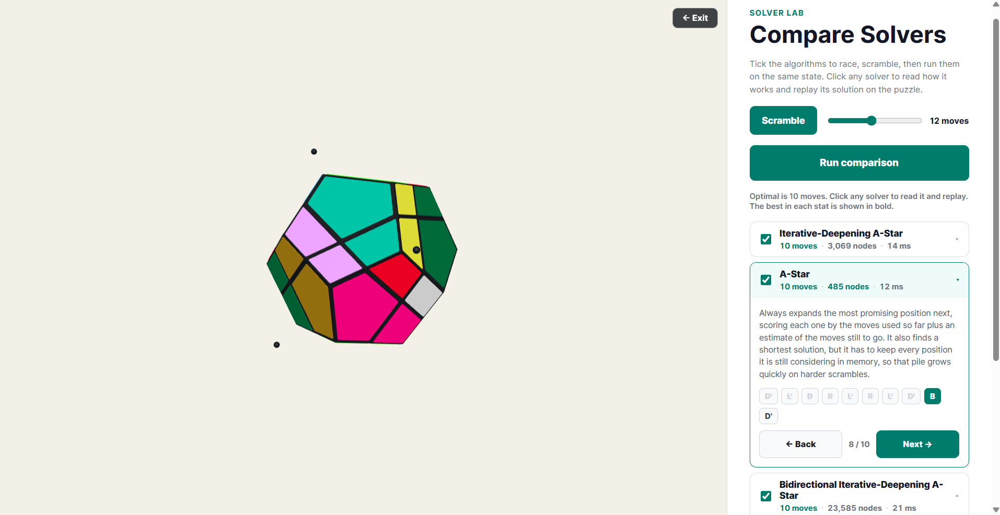

# Skewb Ultimate Solver

A browser-based 3D visualizer and solver for the [Skewb Ultimate](https://www.jaapsch.net/puzzles/ultimate.htm), a dodecahedral twisty puzzle with 12 colors and [100,776,960 reachable positions](https://www.jaapsch.net/puzzles/ultimate.htm) — every one solvable in at most 14 moves.

**[Live demo →](https://colinthebomb1.github.io/skewb-ultimate-solver/)**



## What it does

- Renders the puzzle as individual movable pieces with accurate dodecahedron geometry
- Animates physical 120° turns around the four fixed-corner axes
- Solves scrambles using multiple algorithms and animates the solution step by step
- Races every solver on the same scramble in the "Solver Lab" and explains how each one works
- Lets you enter your real physical cube's colors and solve it directly ("My Cube" mode)
- Shares scrambles via URL hash so you can send a specific position to someone

**Solver panel**



**My Cube mode** — paint your physical cube's colors and solve it directly



**Solver Lab** — race every algorithm on the same scramble, compare length, nodes, and time side by side, then click any solver to read how it works and replay its solution move by move



## Algorithms

Seven solvers are available from the dropdown, and the Solver Lab runs them all on one scramble for a side-by-side comparison. Each makes a different tradeoff between speed, memory, and solution length:

| Algorithm | Approach | Notes |
|---|---|---|
| Iterative-Deepening A\* | Iterative deepening guided by the pattern-database heuristic | **Default.** Fastest here, returns a shortest solution, uses almost no memory |
| A\* | Best-first on moves-so-far plus heuristic | Returns a shortest solution, but holds the whole frontier in memory |
| Bidirectional IDA\* | Split the depth budget and match forward/backward frontiers | Shortest solution. Helps only when the heuristic is weak |
| Bidirectional BFS | Expand from both ends until the frontiers meet | Shortest solution, no heuristic. Memory grows fast, so it can run out on deep scrambles |
| Greedy Best-First | Follow the heuristic alone, ignore path cost | Very fast but short-sighted, solutions run far longer than necessary |
| Two-Phase | Reduce to a simpler subgroup, then finish inside it | Kociemba-style. Fast and near-optimal, not guaranteed shortest |
| Depth-Limited DFS | Plain DFS with a depth cap | Reference baseline, cannot reach the depth real scrambles need |

The IDA\* heuristic is the max of several independent admissible lower bounds: an exact piece-permutation distance (BFS over permutations, ignoring orientations) and two **pattern databases**. Each pattern database fixes a six-piece subset and stores the exact number of moves to bring just those pieces home — both position *and* orientation — found by BFS over the abstracted state space. Because a move's effect on a piece depends only on the slot it occupies, the subset projection is a valid abstraction, so every stored distance is an admissible and consistent lower bound, and so is their max.

Measuring real orientation distance — the hard part of this puzzle, since permutation is already handled exactly — rather than a coarse "wrong orientation" count shrinks the IDA\* search tree by more than 100× on harder scrambles (most dramatically for the single-ended solver).

This is also why plain IDA\* is the default rather than the bidirectional variant. Bidirectional search pays off when the heuristic is weak — meeting in the middle roughly halves the effective search depth. A strong heuristic already collapses the single-ended search toward the goal, so the second search direction (which has no heuristic toward the scrambled start) becomes overhead. With the pattern databases, single-ended IDA\* expands far fewer nodes than the bidirectional version.

Solvers run in a Web Worker so the UI stays responsive during search. The pattern databases (~300K entries) are built once, a few seconds of work that happens off the main thread as the worker starts, so the first solve stays fast.

The four heuristic and breadth-first solvers (Iterative-Deepening A\*, A\*, and both bidirectional searches) return optimal (shortest) solutions. Greedy Best-First and Two-Phase trade optimality for speed, and Depth-Limited DFS is a baseline that only solves within its depth cap. Solving 100,000 random positions to optimality, the mean *shortest* solution length is **10.35 moves** — most positions need 10 or 11 — while the hardest possible positions still solve in the 14-move maximum. (Uniform sampling characterises typical difficulty but won't surface the rare 14-move antipodes; the diameter of 14 comes from [Jaap's full analysis](https://www.jaapsch.net/puzzles/ultimate.htm).)

## Engine

The puzzle engine (`packages/puzzle-core`) is pure TypeScript with no browser dependencies. State is `{ pieces: number[], orientations: number[] }` throughout — no quaternion strings in the hot path. Move tables are precomputed at startup so each `applyMove` is a small indexed array copy. The four axes generate the tetrahedral rotation group (order 12), giving 12 possible piece orientations tracked as integer IDs.

## Running locally

```bash
npm install
npm run dev        # start the Vite dev server
npm test           # run engine and solver tests
npm run bench      # CLI solver benchmark (node)
```

## Stack

- TypeScript monorepo — `puzzle-core`, `solvers`, `bench`, `apps/web`
- Three.js for 3D rendering
- Vite for bundling
- Vitest for tests
- Web Workers for non-blocking solve

## Notation

Moves follow Jaap-style notation: `L`, `R`, `D`, `B` for clockwise 120° turns around each fixed corner, with `'` for inverse. See [NOTATION.md](./NOTATION.md) for the full convention.
